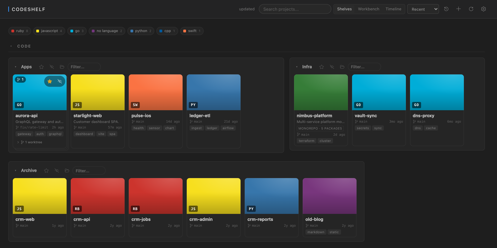
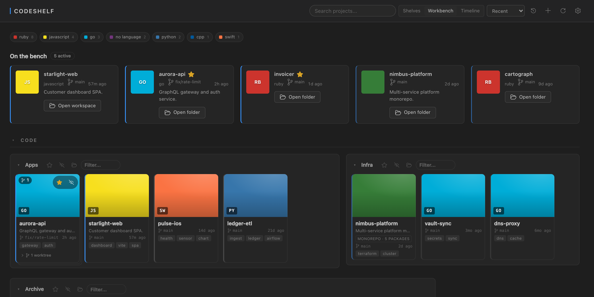
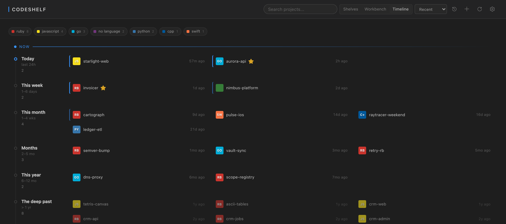

# CodeShelf

**Every project you've ever built, one window away.**

Point CodeShelf at the folders where your code lives and it turns them into a browsable library — cards with language, branch, last-touched time and auto-generated keyword tags. Open a project, or find the one you half-remember, without digging through a file tree.



## Why

A `~/code` folder that has been accumulating for a decade stops being navigable. Most of what is in there is finished, abandoned, or was a weekend. The handful you actually touch is buried among the rest, and the folder tree gives you no way to tell which is which — every directory looks equally alive.

CodeShelf reads that pile and makes it legible: what's warm, what's archived, what a project even *was*.

## Three ways to look at it

**Shelves** mirror your folders. Small shelves sit side by side instead of each claiming a whole row, and a large one shows a single row with the rest a click away.

**Workbench** puts what you're actually working on in front: anything touched in the last fortnight gets a strip at the top with its description and a direct open button, and every card carries a heat edge from hot to frozen.



**Timeline** drops folders entirely and lays the library out by age — Today, This week, This month, Months, This year, The deep past — newest at the top, sinking as it cools.



## What it does

**Finds your projects properly.** Discovery follows the **git repository boundary**: a directory that *is* a repo is one project, and the things inside it are its components. A directory whose *children* are repos is a category — a shelf. That one rule handles monorepos, nested groups and deeply-buried projects without depth limits or naming conventions. Where a folder is genuinely ambiguous, a one-line `.codeshelf` file settles it:

```yaml
kind: project    # or: category
```

**Searches by what a project is, not just its name.** Each project is indexed into a small corpus — a README excerpt, its `.claude/CONTEXT.md`, a description from its package manifest, and the distinctive vocabulary of its own source files. Search "raytracer" and find the project you named `weekend-3`. The file walk honours each project's `.gitignore`, so build output is never indexed.

**Tags projects automatically.** Keyword chips are picked by TF-IDF across your whole library, so they're the words that make a project *distinctive* rather than the words every project shares. Language keywords are filtered out using a denylist harvested from VS Code's own syntax grammars, and a project never tags itself with its own name.

**Collects git worktrees.** Worktrees don't scatter as duplicate cards — they collect onto the parent project as a stacked deck with a count, expanding to list each branch.

**Gets out of the way.** Star what matters, hide what doesn't, fade what's gone stale. `Cmd/Ctrl+K` opens a palette that searches every project across every root, hidden ones included.

## Getting started

1. Install, then run **CodeShelf: Open** from the Command Palette.
2. Click **Add root** and pick a folder that contains projects — `~/code`, `~/Developer`, wherever they live.
3. That's it. Add as many roots as you like.

CodeShelf opens automatically when you launch an **empty** VS Code window. With a folder already open it stays out of the way.

## Settings

| Setting | Type | Default | Description |
| --- | --- | --- | --- |
| `codeshelf.roots` | object | `{}` | Folders to scan, keyed by absolute path (`~` is expanded). |
| `codeshelf.booksetThreshold` | number | `8` | Nested groups with this many projects or fewer are flattened into the shelf. |
| `codeshelf.scanDepth` | number | `3` | How deep to look for projects. |
| `codeshelf.openInNewWindow` | boolean | `false` | Open projects in a new window. |

Each root can carry a label and per-shelf or per-project overrides:

```jsonc
{
  "codeshelf.roots": {
    "~/code": {
      "label": "Work",
      "shelves": {
        "Gems": {
          "name": "Ruby Gems",
          "starred": true,
          "projects": {
            "invoicer": { "starred": true, "description": "Billing and PDF invoices" }
          }
        },
        "Archive": { "hidden": true }
      }
    }
  }
}
```

Shelves and projects can be keyed by absolute path or by folder name. `flatten` accepts `auto`, `always` or `never`.

## Commands

| Command | Description |
| --- | --- |
| **CodeShelf: Open** | Open the library |
| **CodeShelf: Edit Settings (JSON)** | Jump to `codeshelf.roots` |
| **CodeShelf: Clear Cache** | Drop cached shelves and saved poster prompts |
| **CodeShelf: Edit Cache** | Open the cached shelf JSON |

## Poster art

Projects can carry generated SVG poster art — produced locally with the Claude CLI if you have it installed, or you can attach your own image. Injected SVG is sanitised (scripts, event handlers and `javascript:` URLs stripped) before it is ever rendered.

## Privacy

Scanning, indexing and tagging all happen on your machine — CodeShelf reads the folders you point it at, keeps its cache locally, and makes no network requests of its own.

The one exception is opt-in: if you ask it to *generate* poster art, it runs the Claude CLI you already have installed, and that CLI talks to Anthropic. No poster generation, no outbound traffic.

## License

MIT — see [LICENSE](LICENSE).
